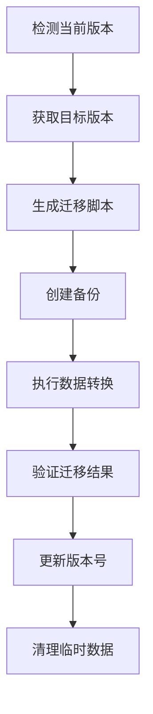

# 数据迁移策略文档

## 概述

本策略文档描述了从 Zustand 状态管理格式迁移到 SQLite 数据库的完整迁移方案，包括数据库版本管理、数据迁移脚本、备份恢复机制以及兼容性处理策略。

## 1. 数据库版本管理

### 1.1 版本控制原则

- **语义化版本控制**: 采用 `major.minor.patch` 格式
  - `major`: 数据库架构重大变更，不向后兼容
  - `minor`: 新功能添加，向后兼容
  - `patch`: 错误修复和优化

### 1.2 版本管理实现

```sql
-- 数据库版本表
CREATE TABLE schema_version (
    id INTEGER PRIMARY KEY AUTOINCREMENT,
    version TEXT NOT NULL UNIQUE,
    applied_at DATETIME DEFAULT CURRENT_TIMESTAMP,
    description TEXT,
    migration_script TEXT
);

-- 初始版本记录
INSERT INTO schema_version (version, description, migration_script) 
VALUES ('1.0.0', 'Initial schema creation', '001_initial_schema.sql');
```

### 1.3 版本管理脚本

```typescript
// version-manager.ts
class DatabaseVersionManager {
  private db: SQLite.Database;

  async getCurrentVersion(): Promise<string> {
    const result = await this.db.get(
      'SELECT version FROM schema_version ORDER BY applied_at DESC LIMIT 1'
    );
    return result?.version || '0.0.0';
  }

  async applyMigration(version: string, description: string, script: string): Promise<void> {
    // 应用迁移脚本
    await this.executeScript(script);
    
    // 记录版本信息
    await this.db.run(
      'INSERT INTO schema_version (version, description, migration_script) VALUES (?, ?, ?)',
      [version, description, script]
    );
  }

  async getAvailableMigrations(): Promise<Migration[]> {
    // 返回待应用的迁移列表
  }
}
```

## 2. 数据迁移脚本

### 2.1 迁移流程设计



### 2.2 Zustand 数据格式分析

假设原 Zustand 状态结构如下：

```typescript
interface ZustandState {
  // 用户相关
  users: User[];
  currentUser: User | null;
  
  // 项目相关
  projects: Project[];
  currentProject: Project | null;
  
  // 通用设置
  settings: {
    theme: 'light' | 'dark';
    language: string;
    notifications: boolean;
  };
  
  // 缓存数据
  cache: {
    [key: string]: any;
  };
}
```

### 2.3 SQLite 目标架构设计

```sql
-- 用户表
CREATE TABLE users (
    id INTEGER PRIMARY KEY AUTOINCREMENT,
    username TEXT UNIQUE NOT NULL,
    email TEXT UNIQUE NOT NULL,
    created_at DATETIME DEFAULT CURRENT_TIMESTAMP,
    updated_at DATETIME DEFAULT CURRENT_TIMESTAMP,
    is_active BOOLEAN DEFAULT 1,
    metadata TEXT -- JSON 格式存储其他字段
);

-- 项目表
CREATE TABLE projects (
    id INTEGER PRIMARY KEY AUTOINCREMENT,
    name TEXT NOT NULL,
    description TEXT,
    owner_id INTEGER,
    created_at DATETIME DEFAULT CURRENT_TIMESTAMP,
    updated_at DATETIME DEFAULT CURRENT_TIMESTAMP,
    status TEXT DEFAULT 'active',
    FOREIGN KEY (owner_id) REFERENCES users(id)
);

-- 设置表
CREATE TABLE settings (
    id INTEGER PRIMARY KEY AUTOINCREMENT,
    user_id INTEGER,
    key TEXT NOT NULL,
    value TEXT NOT NULL,
    updated_at DATETIME DEFAULT CURRENT_TIMESTAMP,
    UNIQUE(user_id, key),
    FOREIGN KEY (user_id) REFERENCES users(id)
);

-- 通用键值存储表
CREATE TABLE kv_store (
    id INTEGER PRIMARY KEY AUTOINCREMENT,
    category TEXT NOT NULL,
    key TEXT NOT NULL,
    value TEXT NOT NULL,
    created_at DATETIME DEFAULT CURRENT_TIMESTAMP,
    updated_at DATETIME DEFAULT CURRENT_TIMESTAMP,
    UNIQUE(category, key)
);

-- 缓存表
CREATE TABLE cache (
    id INTEGER PRIMARY KEY AUTOINCREMENT,
    cache_key TEXT UNIQUE NOT NULL,
    cache_value TEXT NOT NULL,
    expires_at DATETIME,
    created_at DATETIME DEFAULT CURRENT_TIMESTAMP
);
```

### 2.4 数据迁移脚本实现

```typescript
// migration.ts
export class ZustandToSQLiteMigration {
  private db: SQLite.Database;
  private zustandData: any;

  constructor(db: SQLite.Database, zustandData: any) {
    this.db = db;
    this.zustandData = zustandData;
  }

  async executeMigration(): Promise<void> {
    try {
      await this.db.run('BEGIN TRANSACTION');
      
      // 1. 迁移用户数据
      await this.migrateUsers();
      
      // 2. 迁移项目数据
      await this.migrateProjects();
      
      // 3. 迁移设置数据
      await this.migrateSettings();
      
      // 4. 迁移缓存数据
      await this.migrateCache();
      
      await this.db.run('COMMIT');
      console.log('数据迁移成功完成');
    } catch (error) {
      await this.db.run('ROLLBACK');
      throw new Error(`数据迁移失败: ${error.message}`);
    }
  }

  private async migrateUsers(): Promise<void> {
    const users = this.zustandData.users || [];
    
    for (const user of users) {
      await this.db.run(
        `INSERT INTO users (username, email, metadata) VALUES (?, ?, ?)`,
        [
          user.username,
          user.email,
          JSON.stringify({
            ...user,
            // 排除已在表结构中定义的字段
            username: undefined,
            email: undefined
          })
        ]
      );
    }
  }

  private async migrateProjects(): Promise<void> {
    const projects = this.zustandData.projects || [];
    
    for (const project of projects) {
      const ownerId = await this.getUserIdByEmail(project.ownerEmail);
      await this.db.run(
        `INSERT INTO projects (name, description, owner_id, metadata) VALUES (?, ?, ?, ?)`,
        [
          project.name,
          project.description,
          ownerId,
          JSON.stringify({
            ...project,
            name: undefined,
            description: undefined,
            ownerEmail: undefined
          })
        ]
      );
    }
  }

  private async migrateSettings(): Promise<void> {
    const settings = this.zustandData.settings || {};
    
    for (const [key, value] of Object.entries(settings)) {
      await this.db.run(
        `INSERT INTO settings (key, value) VALUES (?, ?)`,
        [key, JSON.stringify(value)]
      );
    }
  }

  private async migrateCache(): Promise<void> {
    const cache = this.zustandData.cache || {};
    
    for (const [key, value] of Object.entries(cache)) {
      await this.db.run(
        `INSERT INTO cache (cache_key, cache_value) VALUES (?, ?)`,
        [key, JSON.stringify(value)]
      );
    }
  }
}
```

## 3. 备份和恢复机制

### 3.1 备份策略

#### 3.1.1 自动备份
```typescript
class BackupManager {
  private backupDir: string = './backups';
  
  async createBackup(reason: string = 'manual'): Promise<string> {
    const timestamp = new Date().toISOString().replace(/[:.]/g, '-');
    const backupFile = `${this.backupDir}/backup_${timestamp}_${reason}.sqlite`;
    
    // 复制数据库文件
    await fs.copy(this.dbPath, backupFile);
    
    // 记录备份信息
    await this.recordBackup({
      file: backupFile,
      timestamp: new Date(),
      reason,
      size: await fs.stat(backupFile).then(s => s.size)
    });
    
    return backupFile;
  }

  async scheduleBackup(interval: 'hourly' | 'daily' | 'weekly'): Promise<void> {
    const schedules = {
      hourly: '0 * * * *',  // 每小时
      daily: '0 2 * * *',   // 每天凌晨2点
      weekly: '0 2 * * 0'   // 每周日凌晨2点
    };
    
    // 使用 node-cron 或类似工具调度备份
  }
}
```

#### 3.1.2 增量备份
```sql
-- 创建变更日志表
CREATE TABLE change_log (
    id INTEGER PRIMARY KEY AUTOINCREMENT,
    table_name TEXT NOT NULL,
    operation TEXT NOT NULL, -- INSERT, UPDATE, DELETE
    record_id INTEGER NOT NULL,
    old_data TEXT, -- JSON 格式
    new_data TEXT, -- JSON 格式
    timestamp DATETIME DEFAULT CURRENT_TIMESTAMP
);

-- 触发器示例
CREATE TRIGGER user_changes_log 
AFTER INSERT ON users
BEGIN
    INSERT INTO change_log (table_name, operation, record_id, new_data)
    VALUES ('users', 'INSERT', NEW.id, json_object('id', NEW.id, 'username', NEW.username));
END;
```

### 3.2 恢复机制

```typescript
class RecoveryManager {
  async restoreFromBackup(backupFile: string): Promise<void> {
    // 1. 验证备份文件完整性
    await this.validateBackupFile(backupFile);
    
    // 2. 创建当前数据库的备份
    await this.createBackup('pre-restore');
    
    // 3. 关闭当前数据库连接
    await this.db.close();
    
    // 4. 替换数据库文件
    await fs.copy(backupFile, this.dbPath);
    
    // 5. 重新连接数据库
    await this.db = await SQLite.open(this.dbPath);
    
    // 6. 验证恢复结果
    await this.validateDatabaseIntegrity();
  }

  async pointInTimeRecovery(targetTime: Date): Promise<void> {
    // 1. 获取最近的完整备份
    const latestBackup = await this.getLatestBackupBefore(targetTime);
    
    // 2. 恢复到备份点
    await this.restoreFromBackup(latestBackup);
    
    // 3. 应用增量变更
    await this.applyIncrementalChanges(latestBackup, targetTime);
  }
}
```

### 3.3 备份文件管理

```typescript
class BackupCleanupManager {
  private retentionPolicy = {
    hourly: 24,    // 保留24小时
    daily: 30,     // 保留30天
    weekly: 12,    // 保留12周
    monthly: 12    // 保留12个月
  };

  async cleanupOldBackups(): Promise<void> {
    const backups = await this.listAllBackups();
    
    for (const backup of backups) {
      const ageInHours = (Date.now() - backup.timestamp.getTime()) / (1000 * 60 * 60);
      const retention = this.getRetentionPeriod(backup.type);
      
      if (ageInHours > retention) {
        await fs.unlink(backup.file);
        console.log(`已删除过期备份: ${backup.file}`);
      }
    }
  }

  private getRetentionPeriod(backupType: string): number {
    return this.retentionPolicy[backupType as keyof typeof this.retentionPolicy] || this.retentionPolicy.daily;
  }
}
```

## 4. 兼容性处理

### 4.1 数据类型映射

```typescript
interface TypeMapping {
  zustandType: string;
  sqliteType: string;
  transformer: (value: any) => any;
}

// 类型映射表
const typeMappings: TypeMapping[] = [
  {
    zustandType: 'string',
    sqliteType: 'TEXT',
    transformer: (value: any) => value
  },
  {
    zustandType: 'number',
    sqliteType: 'REAL',
    transformer: (value: any) => value
  },
  {
    zustandType: 'boolean',
    sqliteType: 'INTEGER', -- SQLite 使用 0/1 表示布尔值
    transformer: (value: any) => value ? 1 : 0
  },
  {
    zustandType: 'object',
    sqliteType: 'TEXT', -- JSON 格式存储
    transformer: (value: any) => JSON.stringify(value)
  },
  {
    zustandType: 'array',
    sqliteType: 'TEXT', -- JSON 格式存储
    transformer: (value: any) => JSON.stringify(value)
  }
];
```

### 4.2 数据验证

```typescript
class DataValidator {
  async validateZustandData(data: any): Promise<ValidationResult> {
    const errors: ValidationError[] = [];
    
    // 验证必需字段
    if (!data.users || !Array.isArray(data.users)) {
      errors.push({ field: 'users', message: 'users 字段必须为数组' });
    }
    
    // 验证数据格式
    if (data.users) {
      for (let i = 0; i < data.users.length; i++) {
        const user = data.users[i];
        if (!user.username || !user.email) {
          errors.push({ field: `users[${i}]`, message: '用户名和邮箱为必需字段' });
        }
      }
    }
    
    return {
      isValid: errors.length === 0,
      errors
    };
  }

  async validateSQLiteSchema(): Promise<ValidationResult> {
    const errors: ValidationError[] = [];
    
    // 验证表结构
    const tables = await this.getAllTables();
    const requiredTables = ['users', 'projects', 'settings', 'kv_store', 'cache'];
    
    for (const table of requiredTables) {
      if (!tables.includes(table)) {
        errors.push({ field: 'schema', message: `缺少必需表: ${table}` });
      }
    }
    
    return {
      isValid: errors.length === 0,
      errors
    };
  }
}
```

### 4.3 渐进式迁移

```typescript
class GradualMigration {
  private migrationSteps = [
    { version: '1.1.0', action: 'create_users_table', description: '创建用户表' },
    { version: '1.1.1', action: 'migrate_basic_user_data', description: '迁移基础用户数据' },
    { version: '1.2.0', action: 'create_projects_table', description: '创建项目表' },
    { version: '1.2.1', action: 'migrate_project_data', description: '迁移项目数据' },
    { version: '1.3.0', action: 'create_settings_table', description: '创建设置表' },
    { version: '1.3.1', action: 'migrate_settings_data', description: '迁移设置数据' }
  ];

  async executeStepByStep(zustandData: any): Promise<void> {
    const currentVersion = await this.versionManager.getCurrentVersion();
    const remainingSteps = this.migrationSteps.filter(
      step => this.compareVersions(step.version, currentVersion) > 0
    );

    for (const step of remainingSteps) {
      try {
        console.log(`正在执行迁移步骤: ${step.description}`);
        
        await this.executeMigrationStep(step, zustandData);
        await this.versionManager.applyMigration(
          step.version,
          step.description,
          `migration_${step.version}.sql`
        );
        
        console.log(`迁移步骤完成: ${step.description}`);
      } catch (error) {
        throw new Error(`迁移步骤失败 [${step.version}]: ${error.message}`);
      }
    }
  }

  private async executeMigrationStep(step: MigrationStep, zustandData: any): Promise<void> {
    switch (step.action) {
      case 'create_users_table':
        await this.createUsersTable();
        break;
      case 'migrate_basic_user_data':
        await this.migrateBasicUserData(zustandData.users);
        break;
      // ... 其他步骤
    }
  }
}
```

### 4.4 回滚机制

```typescript
class RollbackManager {
  async createRollbackPoint(description: string): Promise<string> {
    const rollbackId = `rollback_${Date.now()}`;
    const backupFile = await this.backupManager.createBackup(`rollback-${rollbackId}`);
    
    await this.recordRollbackPoint({
      id: rollbackId,
      description,
      backupFile,
      timestamp: new Date(),
      version: await this.versionManager.getCurrentVersion()
    });
    
    return rollbackId;
  }

  async rollbackToPoint(rollbackId: string): Promise<void> {
    const rollbackPoint = await this.getRollbackPoint(rollbackId);
    
    if (!rollbackPoint) {
      throw new Error(`回滚点不存在: ${rollbackId}`);
    }

    console.log(`开始回滚到: ${rollbackPoint.description}`);
    
    try {
      // 1. 创建当前状态的备份
      await this.createRollbackPoint('pre-rollback');
      
      // 2. 恢复数据
      await this.recoveryManager.restoreFromBackup(rollbackPoint.backupFile);
      
      // 3. 验证恢复结果
      await this.validator.validateSQLiteSchema();
      
      console.log('回滚完成');
    } catch (error) {
      throw new Error(`回滚失败: ${error.message}`);
    }
  }
}
```

## 5. 实施计划

### 5.1 迁移前准备

1. **环境准备**
   - 创建数据库目录结构
   - 安装必要的依赖包
   - 准备测试环境

2. **数据备份**
   - 完整备份现有 Zustand 数据
   - 验证备份完整性
   - 制定恢复计划

3. **测试验证**
   - 在测试环境执行完整迁移流程
   - 验证数据一致性
   - 性能测试

### 5.2 迁移执行步骤

1. **初始化阶段**
   ```bash
   # 创建数据库和基础表结构
   npm run db:init
   
   # 应用初始迁移
   npm run db:migrate
   ```

2. **数据迁移阶段**
   ```bash
   # 执行数据迁移
   npm run db:migrate-data
   
   # 验证迁移结果
   npm run db:validate
   ```

3. **兼容性验证阶段**
   ```bash
   # 运行兼容性测试
   npm run test:compatibility
   
   # 性能基准测试
   npm run test:performance
   ```

### 5.3 迁移后优化

1. **索引优化**
   - 分析查询模式
   - 创建必要索引
   - 删除冗余索引

2. **存储优化**
   - 压缩历史数据
   - 清理缓存
   - 优化表结构

3. **监控设置**
   - 设置性能监控
   - 配置告警机制
   - 建立日志系统

## 6. 最佳实践

### 6.1 性能优化

- 使用事务批量处理数据
- 合理创建索引
- 避免频繁的数据库连接
- 使用连接池管理数据库连接

### 6.2 安全性考虑

- 敏感数据加密存储
- 定期更新数据库凭据
- 审计数据库操作日志
- 实施数据访问控制

### 6.3 监控和维护

- 定期检查数据库健康状态
- 监控迁移脚本执行情况
- 建立自动化备份机制
- 制定应急响应计划

## 7. 故障排除

### 7.1 常见问题

1. **数据类型转换错误**
   - 检查源数据类型
   - 调整转换逻辑
   - 添加数据验证

2. **迁移性能问题**
   - 分批处理大数据集
   - 优化SQL语句
   - 增加系统资源

3. **数据一致性验证失败**
   - 检查数据源完整性
   - 验证转换规则
   - 手动修复异常数据

### 7.2 紧急恢复流程

1. 立即停止相关服务
2. 评估数据损失范围
3. 选择最近的可用备份
4. 执行数据恢复
5. 验证服务功能
6. 通知相关人员

---

*本文档将根据实际实施情况进行更新和完善。*